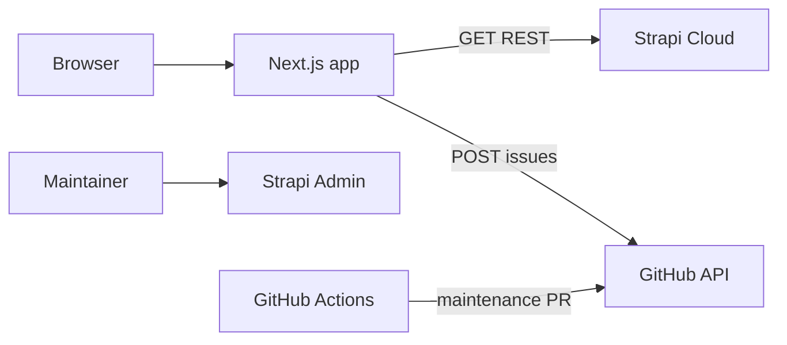

# Architecture

Navigate Tech Hub is a **read-mostly** Next.js site backed by **Strapi Cloud** for guides and external resources, plus **static TypeScript data** for the ColorStack opportunity carousel.

## Runtime modules

| Module | Path | Responsibility |
|--------|------|----------------|
| Frontend app | `frontend/` | App Router pages, UI, `lib/strapi.ts`, `app/api/suggest-resource` |
| Strapi project | `backend/` | CMS schema and CORS for Strapi Cloud |
| Carousel data | `frontend/data/opportunities.ts` | ColorStack opportunities (PR-maintained) |
| Maintenance | `scripts/maintain-opportunities.mjs`, `.github/workflows/opportunities-maintenance.yml` | Link check + PR to update carousel |
| Prod health | `frontend/e2e/public-health*.spec.ts`, `.github/workflows/e2e-prod.yml` | Manual prod Playwright |

## Request lifecycle (typical page)

1. Browser requests a route (`frontend/app/**`).
2. Server Component calls `fetchStrapi()` in `frontend/lib/strapi.ts` with optional `STRAPI_API_TOKEN` (server-only).
3. Strapi returns published resources; Next maps to UI types and renders.
4. ISR: `STRAPI_REVALIDATE_SECONDS` (default 180) caches Strapi responses in production.

## Suggest-resource path

1. Browser `POST /api/suggest-resource` with JSON body.
2. `validatePayload` + `normalizeSuggestionUrl` + in-memory rate limit.
3. Server calls GitHub Issues API with `GITHUB_SUGGEST_TOKEN`.

No Strapi write from the public form.

## References

1. `docs/DOMAIN.md` — content type definitions
2. `frontend/lib/strapi.ts` — Strapi client
3. `frontend/lib/safeUrl.ts` — outbound link sanitization
4. `backend/config/middlewares.ts` — CORS origins
